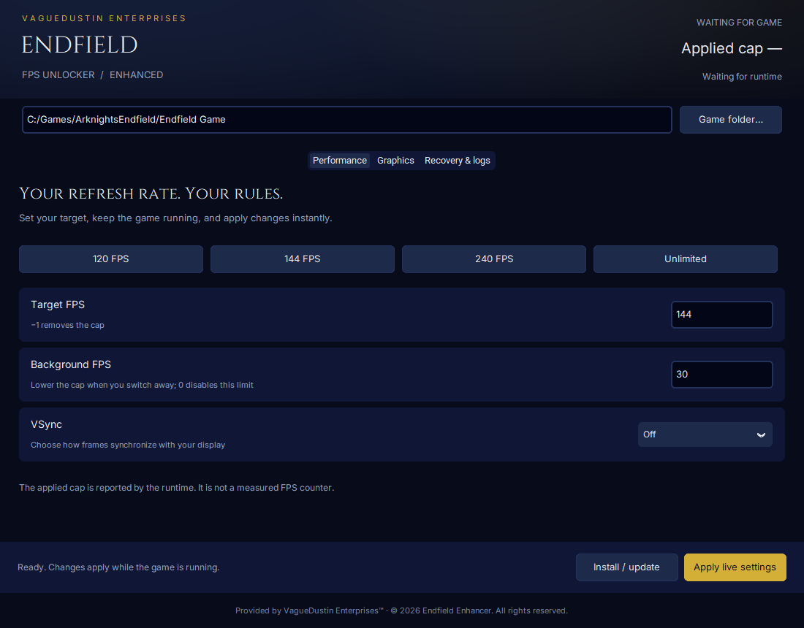

# Arknights Endfield FPS Unlocker Enhanced

A standalone Windows desktop application by **VagueDustin Enterprises** for live FPS control and experimental graphics tuning in Arknights: Endfield. Built from an FPS and graphics modernization of [EightySixK's unlocker](https://github.com/EightySixK/Arknights-Endfield-FPS-Unlocker).
New code lives in `src/modern`. Historical upstream binaries in `bin` are not used.
An initial gameplay test on September 11, 2026 was reported working by the user;
runtime logs also confirm foreground/background target changes. Extended stability
and other rendering modes remain unverified. This is still an experimental build.



## Features

- 120, 144, 240, and unlimited presets; custom targets from 30–1000 FPS.
- Optional background FPS cap; 0 disables the background override.
- Independent VSync control and restoration of the value captured at startup.
- Live settings reload, bounded initialization, and per-process diagnostic logs.
- Reversible installer with checksums, conflict detection, and rollback.
- Desktop panel with Epic installation detection and a command-line manager.
- Opt-in graphics profiles, typed runtime checks, value readback, and reset.
- Upgrade with preservation of the previous build and its configuration.

Version 0.3.1 adds a navy-and-gold live control app, an install wizard, and experimental graphics controls. Graphics controls default to **Game** and
are gated to the inspected runtime SHA-256. Unknown builds retain FPS support
while graphics are disabled. The old graphics code is excluded from the build.

| Control | Values | Behavior |
| --- | --- | --- |
| Anisotropic filtering | Game, off, per-texture, forced on | Unity filtering mode; does not impose a numeric AF level |
| Sharpening | Game, 0–100% | Updates available game, DLSS, FSR3, and PSSR sharpening parameters |
| Render scale | Game, 50–200% | Requests the game's rendering-scale parameter |
| Shadow maps | Game, 512–4096 px | Updates supported CSM, character, punctual, and ASM maps |
| Ambient occlusion | Game, off, on | Toggles GTAO |
| Temporal AA | Game, off, on | Toggles TAAU; does not disable DLSS or FSR |

Graphics profiles: **game** releases all overrides, **crisp** requests forced AF
and 20% sharpening, and **supersample** requests forced AF and 125% render scale.
Apply one control at a time during initial gameplay validation. These settings
can affect GPU load, and a successful readback does not prove a visible effect in
every rendering/upscaling mode.

Graphics changes run only when Unity invokes its render-loop entry point. The
worker thread publishes requests; it never applies graphics changes. Named,
typed methods update parameters, mark their features dirty, and read values back.
The runtime retains original parameter objects with GC handles and restores an
existing override or returns the parameter to game control when reset. Failures
are logged per parameter; an incompatible feature cannot enable raw-offset writes.

## Use the experimental package

Download the artifact from a successful **Windows build and tests** run on the
`modernize-fps` branch. Extract the entire package into its own folder. Keep the
manager next to `package.json` and the two compiled DLLs.

Run **EndfieldEnhancer.exe**, choose the folder containing `Endfield.exe`, inspect
it, and install with the game closed. Defaults: 120 FPS, VSync off, no background
override. If Windows denies write access, run the manager as administrator.

Launch through the normal game launcher. **Apply settings** updates the runtime
within approximately one second. VSync can override the FPS target. Unlimited
uses Unity's desktop value -1 with VSync off; see
[Unity's FPS documentation](https://docs.unity3d.com/ScriptReference/Application-targetFrameRate.html).

For command-line use, run EndfieldManager.exe (or `python manage.py`):

```powershell
.\EndfieldManager.exe inspect --game 'C:\path\to\EndField Game'
.\EndfieldManager.exe install --game 'C:\path\to\EndField Game' --preset high-refresh
.\EndfieldManager.exe configure --game 'C:\path\to\EndField Game' --fps 240 --background 30 --vsync 0
.\EndfieldManager.exe upgrade --game 'C:\path\to\EndField Game'
.\EndfieldManager.exe configure --game 'C:\path\to\EndField Game' --graphics-preset crisp
.\EndfieldManager.exe configure --game 'C:\path\to\EndField Game' --graphics-preset game
.\EndfieldManager.exe rollback --game 'C:\path\to\EndField Game'
.\EndfieldManager.exe diagnostics --game 'C:\path\to\EndField Game'
.\EndfieldManager.exe restore --game 'C:\path\to\EndField Game'
```

Logs are in `%LOCALAPPDATA%\EndfieldEnhancer`. Diagnostics includes the latest
log; check its timestamp because it may belong to an earlier launch or test.

## Installation and recovery

The loader forwards shader compiler calls to an exact copy of the game's original
`d3dcompiler_47.dll`, preserving names and ordinals. It loads only the new FPS
and graphics component. No Vulkan proxy, legacy payload, or boot.config edit is used. The
runtime only activates in a process named Endfield.exe.

Before replacement, the manager saves the original compiler and SHA-256 hashes
in `.endfield-enhancer`. The loader is installed last. Failed writes trigger
restoration. After an interrupted installation, run **restore** before retrying.
Restore refuses to overwrite DLLs changed by a game update or another tool;
preserve the backup for manual recovery. Completed restore archives the original
and last configuration in `.endfield-enhancer-restored*`.

**Install/update** upgrades an existing managed installation with the game closed.
It preserves its configuration and archives the previous DLLs alongside the original
compiler backup. **Previous build** restores that archived build and configuration;
**Uninstall** restores the original compiler. **Reset graphics** leaves FPS settings
unchanged and releases graphics overrides at the next render callback.

Restore before a game update or another compiler-proxy installation. The manager
does not disable anti-cheat or conceal files. Gameplay and account safety cannot
be established by these tests; this remains an experimental game modification.

## Build and test

Requirements: Windows x64, Visual Studio C++ tools and Windows SDK, CMake 3.24+,
Git, and Python 3.11+. MinHook is built from a pinned source revision.

```powershell
python -m unittest discover -s tests -v
cmake -S . -B build -A x64
cmake --build build --config Release
ctest --test-dir build -C Release --output-on-failure
cmake --install build --config Release --prefix build/package
python tools/package_build.py build/package
```

The native harness tests real Windows compiler forwarding and a fake IL2CPP
runtime: live FPS/VSync changes, VSync restore, background cap, thread attachment,
graphics updates from the render callback, type validation, rejected settings,
original overrides, GC handle release, unknown builds, and bad callback signatures.
It does not replace testing on the real game engine.
CI also builds standalone managers with PyInstaller.

## Further gameplay validation

Check startup logs, measured FPS, focus loss/return, live settings, menus,
teleporting between regions, and an extended play session. Test rendering modes
separately, then restore and verify a clean launch. Verify each graphics control
visually and inspect its runtime readback before treating it as game-validated.

MIT license. Original copyright and attribution are preserved in LICENSE.

## Windows app and installer

Download the setup executable from [Releases](https://github.com/VagueDustin/arknights-endfield-fps-unlocker-enhanced/releases), or the `EndfieldEnhancer-setup` Actions artifact while a release is in testing. Setup installs the desktop app under your user profile and adds a Start menu shortcut. Open the app, select the game folder, and choose **Install / update** with the game closed.

Use **Apply live settings** during gameplay. The header reports the running process and the last cap acknowledged by its runtime log; it does not measure actual FPS. Graphics controls remain experimental and report availability in the runtime log.

The app records managed installation locations. Uninstalling the app restores those game installations first; if a game is running or its files have changed, uninstall stops and retains the app for recovery. Original backups are retained in the game directory.

This repository is independent on GitHub and retains the original project's MIT license and history. No game binaries or private brand repository contents beyond the selected public-facing theme tokens are distributed.

Provided by VagueDustin Enterprises™ · © 2026 Endfield Enhancer. All rights reserved. Source code licensing is governed by LICENSE.
