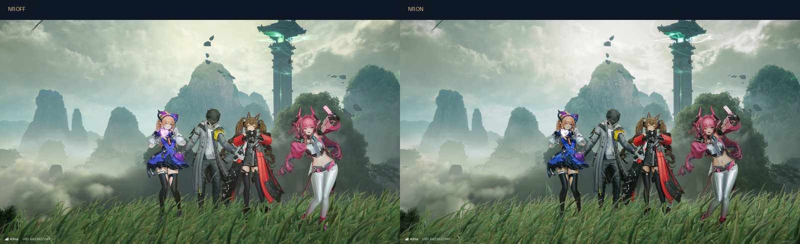
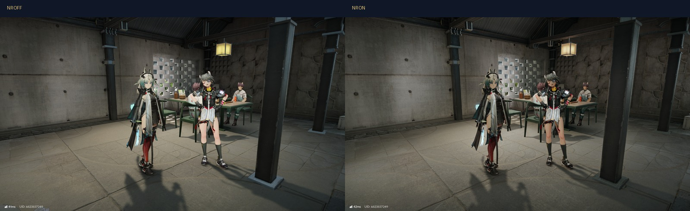
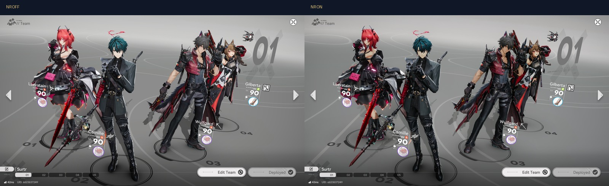
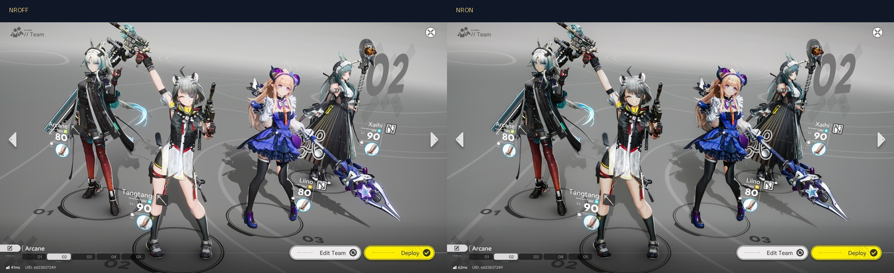
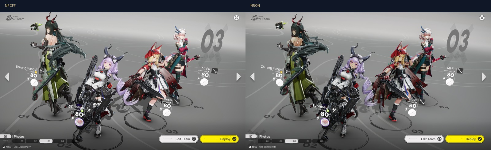
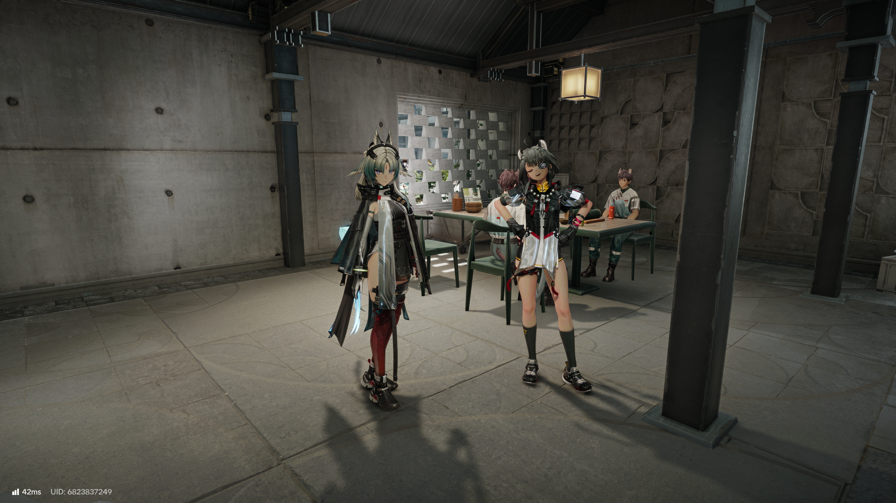
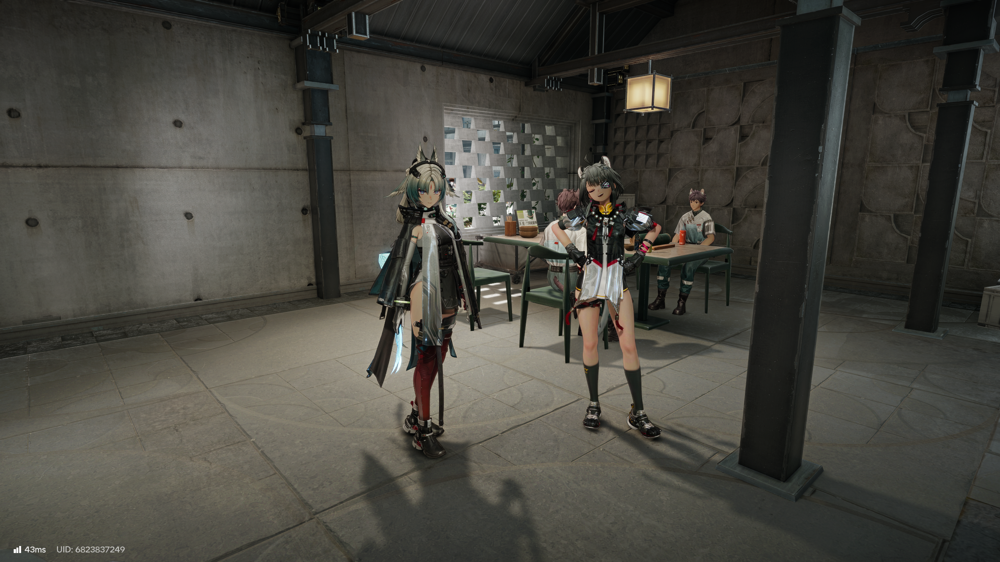
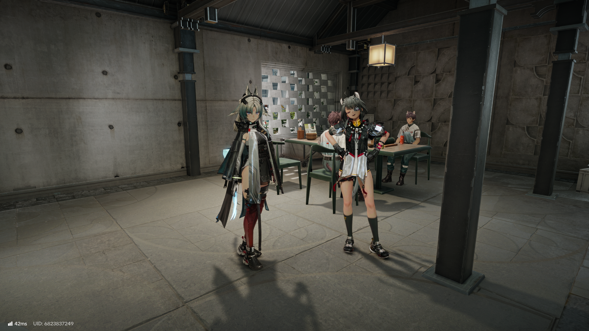
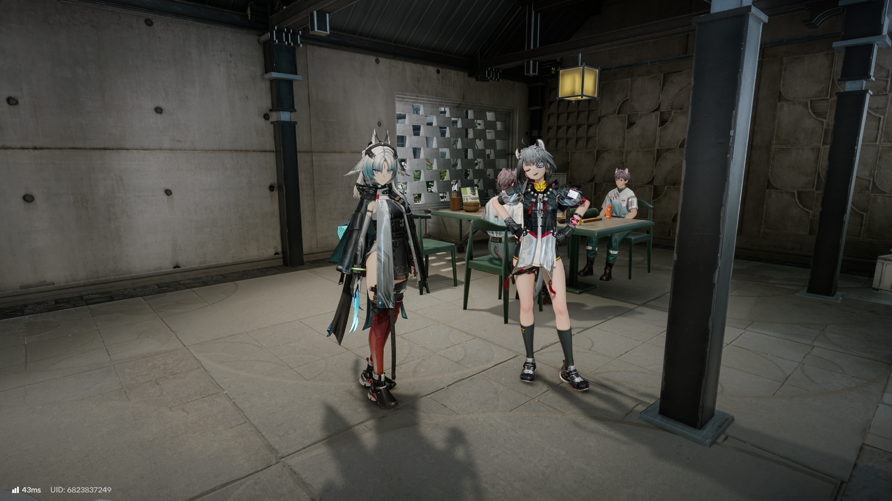
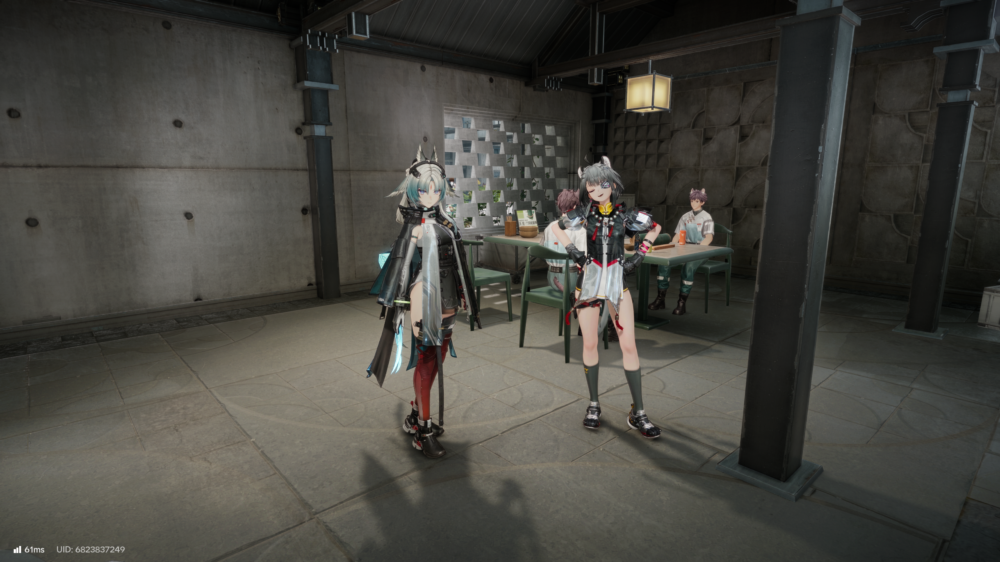

# Fate Engine - Arknights Endfield FPS Unlocker

[Download Fate Engine 0.4.4 for Windows](https://github.com/VagueDustin/arknights-endfield-fps-unlocker-enhanced/releases/tag/v0.4.4) - stable release. Includes the tested ReShade setup and DLSS 5 components. [Installation and in-game controls](docs/DLSS-RESHade-SETUP.md).

### [View interactive DLSS 5 comparisons](https://vaguedustin.github.io/arknights-endfield-fps-unlocker-enhanced/)

Drag the comparison slider or switch between Off / On, presets, and styles. No download required.

A standalone Windows desktop application by **VagueDustin Enterprises** for live FPS control and experimental graphics tuning in Arknights: Endfield. Community pull requests are welcome; VagueDustin maintains the project and controls releases.
The native implementation lives in `src/modern`. See [third-party notices](THIRD_PARTY_NOTICES.md) for project origins and dependency attribution.
An initial gameplay test on September 11, 2026 was reported working by the user;
runtime logs also confirm foreground/background target changes. Extended stability
and other rendering modes remain unverified. Graphics tuning remains experimental.


## DLSS 5 screenshot comparisons

Neural rendering is working in the local experimental setup. **Requires a GeForce RTX 50-series GPU**: the tested NVIDIA neural runtime does not run on RTX 40 or older cards, and Fate Engine refuses the DLSS 5 setup when the game's Player.log shows another GPU. **Insert** toggles it on and off; this is our default binding for Endfield. See [keybindings](docs/DLSS5-KEYBINDINGS.md) and [tested components and limitations](docs/DLSS5-FEASIBILITY.md). The 0.4.4 bundled installer includes the tested components. Choose the DLSS 5 page for its three-step ReShade setup. Presets are controlled in the ReShade overlay with Home.

**Off on the left, on on the right:**

[](https://vaguedustin.github.io/arknights-endfield-fps-unlocker-enhanced/)

**[Open the interactive gallery](https://vaguedustin.github.io/arknights-endfield-fps-unlocker-enhanced/)** for a draggable divider and instant **Off / Compare / On** buttons. It includes all five scenes, three numbered presets, and the Natural and Cinematic styles. You can also download or clone the repository and open `docs/comparisons/index.html` locally. GitHub Pages hosts the interactive view; the README below provides expandable static comparisons.

<details>
<summary>Interior - Default neural rendering</summary>



[Full-size off](docs/comparisons/off.webp) / [Full-size default](docs/comparisons/default.webp)

</details>

<details>
<summary>Team 1 - off / on</summary>



[Full-size off](docs/comparisons/t1-off.webp) / [Full-size on](docs/comparisons/t1-on.webp)

</details>

<details>
<summary>Team 2 - off / on</summary>



[Full-size off](docs/comparisons/t2-off.webp) / [Full-size on](docs/comparisons/t2-on.webp)

</details>

<details>
<summary>Team 3 - off / on</summary>



[Full-size off](docs/comparisons/t3-off.webp) / [Full-size on](docs/comparisons/t3-on.webp)

</details>

<details>
<summary>Explore NR presets and styles</summary>

| Preset 1 | Preset 2 | Preset 3 |
| --- | --- | --- |
|  |  |  |

| Default | Natural | Cinematic |
| --- | --- | --- |
|  |  |  |

</details>

These are separate user-supplied captures, not synchronized frames or a controlled benchmark. Poses, camera, UI, and lighting can differ, especially between interior styles and presets. Full-size images preserve the original pixels as lossless WebP; side-by-side README previews are resized. The observed 110 FPS off / 50 FPS on result was from one earlier scene and should not be read as a benchmark for every screenshot.

## Features

- DLSS 5 panel: inspect the tested setup, import user-supplied components, save next-launch settings, and remove managed addon files. [Setup and recovery](docs/DLSS5-SETUP.md).
- 120, 144, 240, and unlimited presets; custom targets from 30-1000 FPS.
- Optional background FPS cap; 0 disables the background override.
- Independent VSync control and restoration of the value captured at startup.
- Live settings reload, bounded initialization, and per-process diagnostic logs.
- Reversible installer with checksums, conflict detection, and rollback.
- Desktop panel with Epic installation detection and a command-line manager.
- Opt-in graphics profiles, typed runtime checks, value readback, and reset.
- Upgrade with preservation of the previous build and its configuration.

The desktop app provides a navy-and-gold live control panel, an install wizard, and experimental graphics controls. Graphics controls default to **Game** and
are gated to the inspected runtime SHA-256. Unknown builds retain FPS support
while graphics are disabled. The old graphics code is excluded from the build.

| Control | Values | Behavior |
| --- | --- | --- |
| Anisotropic filtering | Game, off, per-texture, forced on | Unity filtering mode; does not impose a numeric AF level |
| Sharpening | Game, 0-100% | Updates available game, DLSS, FSR3, and PSSR sharpening parameters |
| Render scale | Game, 50-200% | Requests the game's rendering-scale parameter |
| Shadow maps | Game, 512-4096 px | Updates supported CSM, character, punctual, and ASM maps |
| Ambient occlusion | Game, off, on | Toggles GTAO |
| Temporal AA | Game, off, on | Toggles TAAU; does not disable DLSS or FSR |

Graphics profiles: **game** releases all overrides, **crisp** requests forced AF
and 20% sharpening, and **supersample** requests forced AF and 125% render scale.
Apply one control at a time during initial gameplay validation. These settings
can affect GPU load, and a successful readback does not prove a visible effect in
every rendering/upscaling mode.

Graphics changes run only when Unity invokes its render-loop entry point. The
worker thread publishes requests; it never applies graphics changes. Named,
typed methods update parameters, mark their features dirty, and read values back.
The runtime retains original parameter objects with GC handles and restores an
existing override or returns the parameter to game control when reset. Failures
are logged per parameter; an incompatible feature cannot enable raw-offset writes.

## Use the experimental package

Download the artifact from a successful **Windows build and tests** run on the
`main` branch. Extract the entire package into its own folder. Keep the
manager next to `package.json` and the two compiled DLLs. The CI installer artifact is
the unbundled build, named `...-unbundled.exe`: it has no ReShade setup or DLSS 5
components and asks for your own copies. The bundled download is only on the Releases page.

Run **FateEngine.exe**, choose the folder containing `Endfield.exe`, inspect
it, and install with the game closed. The desktop defaults to 144 FPS, VSync off, and a 30 FPS background cap;
existing settings are loaded when available. CLI defaults are 120 FPS and no background cap. If Windows denies write access, run the manager as administrator.

Launch through the normal game launcher. **Apply live settings** updates the runtime
within approximately one second. VSync can override the FPS target. Unlimited
uses Unity's desktop value -1 with VSync off; see
[Unity's FPS documentation](https://docs.unity3d.com/ScriptReference/Application-targetFrameRate.html).

For command-line use, run EndfieldManager.exe (or `python manage.py`):

```powershell
.\EndfieldManager.exe inspect --game 'C:\path\to\EndField Game'
.\EndfieldManager.exe install --game 'C:\path\to\EndField Game' --preset high-refresh
.\EndfieldManager.exe configure --game 'C:\path\to\EndField Game' --fps 240 --background 30 --vsync 0
.\EndfieldManager.exe upgrade --game 'C:\path\to\EndField Game'
.\EndfieldManager.exe configure --game 'C:\path\to\EndField Game' --graphics-preset crisp
.\EndfieldManager.exe configure --game 'C:\path\to\EndField Game' --graphics-preset game
.\EndfieldManager.exe rollback --game 'C:\path\to\EndField Game'
.\EndfieldManager.exe diagnostics --game 'C:\path\to\EndField Game'
.\EndfieldManager.exe export-diagnostics --game 'C:\path\to\EndField Game'
.\EndfieldManager.exe restore --game 'C:\path\to\EndField Game'
```

Logs are in `%LOCALAPPDATA%\EndfieldEnhancer`. Diagnostics includes the latest
log; check its timestamp because it may belong to an earlier launch or test.

## Installation and recovery

The loader forwards shader compiler calls to an exact copy of the game's original
`d3dcompiler_47.dll`, preserving names and ordinals. It loads only the new FPS
and graphics component. No Vulkan proxy, legacy payload, or boot.config edit is used. The
runtime only activates in a process named Endfield.exe.

Before replacement, the manager saves the original compiler and SHA-256 hashes
in `.endfield-enhancer`. The loader is installed last. Failed writes trigger
restoration. After an interrupted installation, run **restore** before retrying.
Restore refuses to overwrite DLLs changed by a game update or another tool;
preserve the backup for manual recovery. Completed restore archives the original
and last configuration in `.endfield-enhancer-restored*`.

**Install/update** upgrades an existing managed installation with the game closed.
It preserves its configuration and archives the previous DLLs alongside the original
compiler backup. **Previous build** restores that archived build and configuration;
**Uninstall** restores the original compiler. **Reset graphics** leaves FPS settings
unchanged and releases graphics overrides at the next render callback.

Restore before a game update or another compiler-proxy installation. The manager
does not disable anti-cheat or conceal files. Gameplay and account safety cannot
be established by these tests; this remains an experimental game modification.

## Troubleshooting

**Set up FPS unlocker seems to do nothing.** Outcomes appear in the status bar and as a dialog; the full result stays on the **Recovery** page. If the message mentions denied access, accept the prompt to restart Fate Engine as administrator. Game folders that Epic or the game launcher did not create are often read-only for normal users.

**The game runs but the header stays on "Waiting for runtime" or shows "Runtime not detected".** The loader never started inside Endfield. The runtime starts when the game loads `d3dcompiler_47.dll` from its folder, which Endfield does through its embedded browser components rather than at engine start, so a working session reports the runtime some seconds after launch. A session that never loads that library, or in which anti-cheat or antivirus software blocks the load, never starts the runtime. Open **Recovery > Inspect installation**; `changed_or_missing_files` must be empty. Antivirus software sometimes quarantines `endfield_fps.dll` or the proxy `d3dcompiler_47.dll`. Restore them from quarantine, exclude the game folder, then run **Set up FPS unlocker** again. If the files are intact, choose **Export diagnostics** and attach the report to an issue; it records how long the game ran, whether the runtime ever reported, and the anti-cheat service state during the session.

**Check setup says the GPU cannot run DLSS 5.** The bundled NVIDIA neural runtime targets GeForce RTX 50-series GPUs. On RTX 40 and older cards ReShade would load but neural rendering cannot start, so Fate Engine stops before installing anything. The FPS unlocker does not depend on the GPU.

**ReShade does not open with Home.** On the **DLSS 5** page choose **Check setup**. It explains why the ReShade Vulkan layer is not registered (wrong application path, missing files, or a declined administrator prompt), which renderer the last Endfield launch used, and whether ReShade initialized and loaded the add-ons. The tested setup needs Endfield on **Vulkan**; on Direct3D the layer and the DLSS 5 bridge never load.

**ReShade opens but neural rendering has no effect.** NR starts off; press **Insert**. The NVIDIA NR runtime needs an RTX 50-series GPU and a DLSS 5-capable driver. Check setup reports how often NR was switched on in the last logged session.

Attach the file written by **Export diagnostics** (or `EndfieldManager.exe export-diagnostics --game '...'`) to any report. It contains folder paths and log excerpts only.

## Build and test

Requirements: Windows x64, Visual Studio C++ tools and Windows SDK, CMake 3.24+,
Git, and Python 3.11+. MinHook is built from a pinned source revision.

```powershell
python -m unittest discover -s tests -v
cmake -S . -B build -A x64
cmake --build build --config Release
ctest --test-dir build -C Release --output-on-failure
cmake --install build --config Release --prefix build/package
python tools/package_build.py build/package
```

The native harness tests real Windows compiler forwarding and a fake IL2CPP
runtime: live FPS/VSync changes, VSync restore, background cap, thread attachment,
graphics updates from the render callback, type validation, rejected settings,
original overrides, GC handle release, unknown builds, and bad callback signatures.
It does not replace testing on the real game engine.
CI also builds standalone managers with PyInstaller.

## Further gameplay validation

Check startup logs, measured FPS, focus loss/return, live settings, menus,
teleporting between regions, and an extended play session. Test rendering modes
separately, then restore and verify a clean launch. Verify each graphics control
visually and inspect its runtime readback before treating it as game-validated.

MIT license. Project licensing is in LICENSE; applicable upstream notices are preserved in THIRD_PARTY_NOTICES.md and licenses/.

## Windows app and installer

Download the setup executable from [Releases](https://github.com/VagueDustin/arknights-endfield-fps-unlocker-enhanced/releases), or the `EndfieldEnhancer-setup` Actions artifact while a release is in testing. Setup installs the desktop app under your user profile and adds a Start menu shortcut. Open the app, select the game folder, and choose **Install / update** with the game closed.

Use **Apply live settings** during gameplay. The header reports the running process and the last cap acknowledged by its runtime log; it does not measure actual FPS. Graphics controls remain experimental and report availability in the runtime log.

The app records managed installation locations. Uninstalling the app restores those game installations first; if a game is running or its files have changed, uninstall stops and retains the app for recovery. Original backups are retained in the game directory.

This repository is independent on GitHub and retains the original project's MIT license and history. No game binaries or private brand repository contents beyond the selected public-facing theme tokens are distributed.

The 0.4.0 installer offers a current-user company folder without admin, or an all-users installation under `C:\Program Files\VagueDustin Enterprises\Fate Engine` with elevation. The Start menu name includes **Arknights Endfield FPS Unlocker** for search. Game-file permissions remain separate from app installation permissions.

The tested DLSS 5 components ship in the bundled installer since 0.4.4. See [DLSS 5 with ReShade](docs/DLSS-RESHade-SETUP.md) for setup and the [feasibility notes](docs/DLSS5-FEASIBILITY.md) for how the stack was validated. Releases are assembled per [docs/RELEASE.md](docs/RELEASE.md).

Provided by VagueDustin Enterprises™ · © 2026 Fate Engine. All rights reserved. Source code licensing is governed by LICENSE.

## Live validation

On September 11, 2026, version 0.3.2 connected to the inspected game's render loop.
Anisotropic filtering, seven sharpening parameters, render scale, four shadow-map
parameters, GTAO, and TAAU accepted requests and returned matching typed readbacks.
Every tested override was then reset to game control; the client remained responsive.
This establishes parameter control, not a benchmark or proof of visible effects
in every renderer, scene, or upscaling mode. Extended stability testing remains open.
